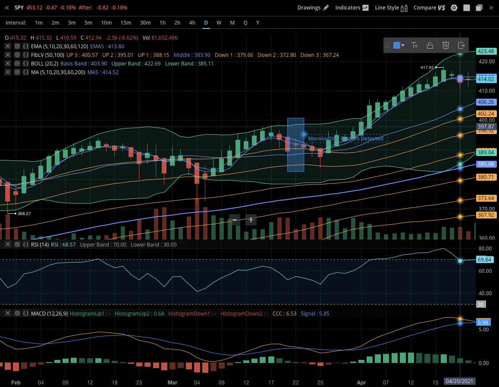

# Candlestick-Pattern-Recognition-with-Python-and-TA-Lib

### Goal
- Look at the S&P500 to try and get a better understanding of these candlestick patterns and how we can use them to find actionable ideas for trades programmatically.
- Benefits doing this programmatically is that it saves us time.
- Be able to detect these technical patterns using python.
- Analyze the S&P500 for all the technical patterns.
- Scanner for technical patterns
- Web application 

### Example of Technical Patterns
- Engulfing Pattern

## DEMO

- Example of getting data on a stock from a certain start date to end date
- "data = yf.download("SPY", start="2021-01-01", end="2021-10-22")" YIELDS:

- Output of data on dates that have and dont have the morningstar pattern, 0 for it doesnt have and 100 for it does.

- "num = talib.CDLMORNINGSTAR(data Open, data High, data Low , data Close )"

- If we print out "print(num[num !=0])" we see the dates that indicate a MorningStar pattern is detected 

- The date that our program has outputted is 2021-03-22
- If we observe this date we can confirm the MorningStar Pattern has been detected

